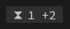

# Tmux Tasks

This `tmux` plugin shows a simple count of your urgent and non-urgent tasks.




## Usage

Add `#{tasks_status}` to your `status-left` or `status-right`:

```
set -g status-right '#{tasks_status} %a %Y-%m-%d %H:%M'
```


## Installation

1. Install [Tmux Plugin Manager][tpm].

2. Add this plugin to your `~/.tmux.conf`:

```
set -g @plugin 'chriszarate/tmux-tasks'
```

3. Press [prefix] + `I` to install.


## Configuration

The following configuration variables can be set in your `~/.tmux.conf` (shown
here with their default values):

```
# Task manager
set -g @tasks_manager 'taskwarrior'

# Colors
set -g @tasks_format_begin '#[fg=white,bg=colour236]'
set -g @tasks_format_end '#[fg=white,bg=black]'

# Icons
set -g @tasks_icon_urgent '⧗ '
set -g @tasks_icon_outstanding '+'
```


## Supported task managers

Currently, [TaskWarrior][task] is the only supported task manager. Suggestions
for additional task managers to support is welcome.


[tpm]: https://github.com/tmux-plugins/tpm
[task]: https://taskwarrior.org
